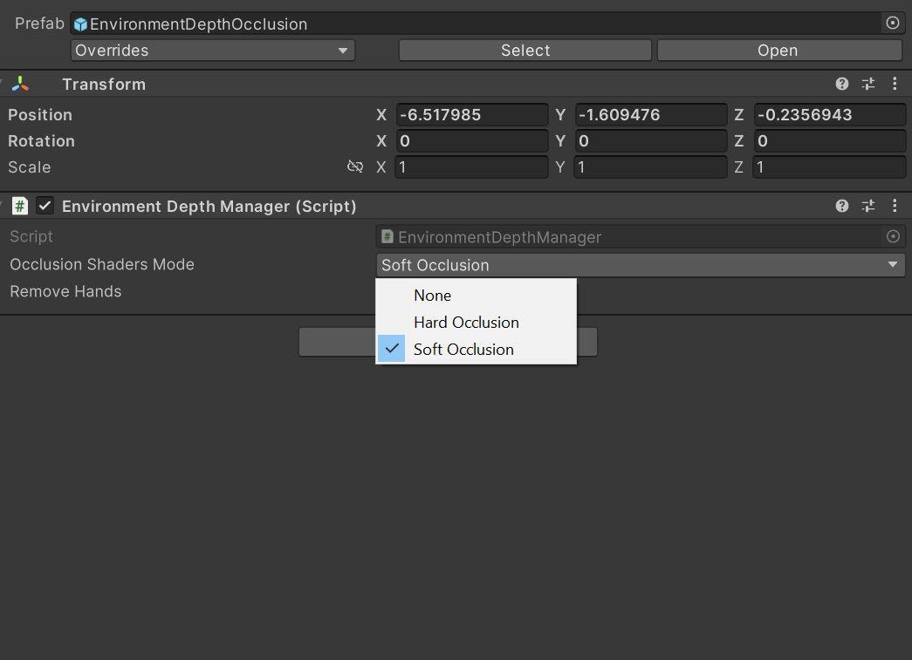

# Depth API
Depth API is a new feature that exposes to applications real-time, per-eye, per-frame, environment depth estimates from the headset’s point of view.
This repository shows how Depth API can be used to implement dynamic occlusions.
This technique is essential for rendering believable visual interactions between virtual and physical content in your apps. This enables a more coherent sense of reality for your users.

You can learn more about Depth API [here](https://developer.oculus.com).

This is an [experimental feature](https://developer.oculus.com/experimental/experimental-overview).
Make sure to run this command to enable Depth API on your Quest 3:
```sh
adb shell setprop debug.oculus.experimentalEnabled 1
```

## Health & Safety Guidelines
While building mixed reality experiences, we highly recommend evaluating your content to offer your users a comfortable and safe experience. Please refer to the [Mixed Reality H&S Guidelines](https://developer.oculus.com/resources/mr-health-safety-guideline/) before designing and developing your app using this sample project or any of our Presence Platform Features.

# Dynamic Occlusion
This repository contains two occlusion implementations: hard occlusion and soft occlusion.

* Hard occlusion is cheaper to compute, but has a jagged edge and more visible temporal instability.
* Soft occlusion is visually more appealing, but requires more GPU.


You can learn more about occlusion and general guidelines for when and how to use the feature [here](https://developer.oculus.com).

## DepthAPI Requirements
* **2022.3.1 and higher**
* **2023.2 and higher**
* **Unity Oculus Integration SDK** by using one of:
  * [Unity Oculus Integration SDK 57.0 all-in-one or higher](https://developer.oculus.com/downloads/package/unity-integration)
  * **com.meta.xr.sdk.utilities** (57.0.0-preview or higher). You may find it at [npm.developer.oculus.com](https://npm.developer.oculus.com/-/web/detail/com.meta.xr.sdk.utilities). Instructions on importing individual SDKs in Unity may be found [on the official oculus documentation](https://developer.oculus.com/documentation/unity/unity-package-manager/).
* **Unity XR Oculus** package version - 4.2.0-exp-env-depth.1
* Oculus Quest 3

# Getting started with samples

### Using github
First, ensure you have Git LFS installed by running this command:
```sh
git lfs install
```

Then, clone this repo using the **Code** button above, or this command:
```sh
git clone https://github.com/oculus-samples/Unity-DepthAPI
```

### Unity Projects
[Use our Unity Set Up guide to setup Unity](https://developer.oculus.com/documentation/unity/book-unity-gsg/). See the Requirements section above for minimum versions of engine supported.

Open one of two sample projects, DepthAPI-BiRP or DepthAPI-URP, located in the cloned Unity-DepthAPI folder.
Both implement the same examples, and exist to showcase different rendering pipelines that Unity offers: Built-in and URP respectively.
Use [Unity's render pipeline overview article](https://docs.unity3d.com/Manual/render-pipelines-overview.html) to understand differences.

### Scenes
The scenes are located in the same path for both sample projects: `./Assets/DepthAPISample/Scenes`.

#### OcclusionToggler
This scene showcases the general setup of the occlusion feature and how to switch between different modes.

When the scene is built for device, users can press the A button on the right controller to toggle between three modes: NoOcclusion, HardOcclusion and SoftOcclusion.


#### PerObjectOcclusion
In this scene, we show a particular setup where each object has different behaviour for occlusions.


# Using the `com.meta.xr.depthapi` package

## Getting started with Depth API

### 1.Prerequisites

Make sure you have the supported Unity setup listed above.

Ensure Passthrough is working in your project by following [these instructions](https://developer.oculus.com/documentation/unity/unity-passthrough-gs/).

Depth API requires an experimental Unity XR Oculus, it needs to be imported in Unity Package Manager via [Add package by name](https://docs.unity3d.com/Manual/upm-ui-quick.html).

Name:
```
com.unity.xr.oculus
```
Version:
```
4.2.0-exp-env-depth.1
```

### 2.Importing Depth API package

There are 2 packages that need [importing from git url](https://docs.unity3d.com/Manual/upm-ui-giturl.html)

```
https://github.com/oculus-samples/Unity-DepthAPI.git?path=/Packages/com.meta.xr.depthapi
```

* If your project is using URP, Depth API has a separate set of shaders in a separate package. To access these shaders, add the following package url:
```
https://github.com/oculus-samples/Unity-DepthAPI.git?path=/Packages/com.meta.xr.depthapi.urp
```
### 3.Project Setup Tool

Depth API has several requirements that need to be met before it can work:
* Graphics API needs to be set to Vulkan.
* Stereo Rendering Mode needs to be set to Multiview.
* The Passthrough feature needs to be enabled and integrated into every scene that will use Depth API.
* Android Manifest needs the USE_SCENE permission to be enabled by setting scene support to **Required** in OVRManager.
* Experimental features support has to be enabled.

To aid with this, you can use the Project Setup Tool (PST). This will detect any problems and/or recommendations and provides an easy way to easily fix them. To access this tool you have two options:

* In the bottom right corner of the editor, there is a small Oculus icon. Clicking on it will bring up a menu that lets you access the PST. It also has a notification badge whenever any issues are detected to let you know that a fix is required.


* You can also access PST from Unity’s top menu "Oculus > Tools > Project Setup Tool"

Once open, you will be presented with a menu that displays all issues and recommendations for solutions. All outstanding issues need to be fixed before the Depth API can work. **Recommended Items** should be applied as well.


### 4.Adding occlusions to a scene

To add occlusions to your scene we’ve supplied a prefab named **EnvironmentDepthOcclusion** for ease of use. Drag and drop it onto your scene. This prefab is found under `Packages/Depth API/Runtime/Core/Prefabs`.

Once you do this, hit Ctrl-S to save your scene. You now need to add the **Passthrough Feature** to your scene (if you don’t already have it). You may use PST to handle this process automatically by hitting **Fix All** once more. Passthrough is essential for Depth API to function. More info on passthrough can be found in [the official documentation](https://developer.oculus.com/documentation/unity/unity-passthrough-gs/).


### 5.Adding occlusion shaders to our objects

Depth API comes with shaders that need to be applied to materials of objects on which we want occlusions to be applied to. The implementation differs between [rendering pipelines](https://docs.unity3d.com/Manual/render-pipelines.html). This repository includes shaders for URP and BiRP. Continue with the one that is relevant to your project.

#### **For BiRP**
Let’s consider the objects in your scene. If you wish to have them be occluded we need to apply the appropriate shader to their materials. If you have an object with a **Standard** shaded material on it, simply change the shader in the material to **OcclusionStandard**.You can find this shader under **Meta/Depth/BiRP**` when selecting the shader.


These are the shaders that come pre-packaged with Depth API for BiRP:

| Unity shader          | Depth API shader               |
|-----------------------|--------------------------------|
| Standard              | Occlusion Standard             |
| ParticleStandardUnlit | OcclusionParticleStandardUnlit |

#### **For URP**
Consider the objects in your scene. If we wish to have them be occluded we need to apply the appropriate shader to their materials. If you have an object that has Unity’s **Lit** shaded material in your scene simply change the shader to the Depth API variant shader called **Occlusion Lit**. You may find this shader under **Meta/Depth/URP/** when selecting the shader.


These are the shaders that come prepackaged with Depth API for URP:

| Unity Shader                          | Depth API shader                                |
|---------------------------------------|-------------------------------------------------|
| Lit                                   | Occlusion Lit                                   |
| Unlit                                 | Occlusion Unlit                                 |
| Simple Lit                            | Occlusion Simple Lit                            |
| Baked Lit                             | Occlusion Baked Lit                             |
| Particles / Unlit (/Lit / Simple Lit) | Occlusion Particles / Unlit (/Lit / Simple Lit) |

### 6.Enabling/configuring occlusions

The **EnvironmentDepthOcclusion** object we added in the previous steps has a component that lets you set occlusion types in your project.



### 7. Implementing Occlusion in custom shaders

If you have your own custom shaders you can convert them to occluded versions by applying some small changes to them.

For BiRP, use the following include statement:
```ShaderLab
#include "Packages/com.meta.xr.depthapi/Runtime/BiRP/EnvironmentOcclusionBiRP.cginc"
```
For URP:
```ShaderLab
#include "Packages/com.meta.xr.depthapi/Runtime/URP/EnvironmentOcclusionURP.hlsl"
```
#### Step 1. Add occlusion keywords
```Shaderlab
// DepthAPI Environment Occlusion
#pragma multi_compile _ HARD_OCCLUSION SOFT_OCCLUSION
```
#### Step 2. Add positionNDC to your **vertex** output struct
```ShaderLab
struct v2f
{
   float4 vertex : SV_POSITION;
   float4 positionNDC : TEXCOORD0;

   UNITY_VERTEX_INPUT_INSTANCE_ID
   UNITY_VERTEX_OUTPUT_STEREO // required for stereo
};
```
#### Step 3. Calculate NDC in vertex shader:
Vertex shaders need to calculate positionNDC (NDC stands for Normalized Device Coordinates).
Example:
```Shaderlab
v2f vert (appdata v) {
   v2f o;

   UNITY_SETUP_INSTANCE_ID(v);
   UNITY_INITIALIZE_VERTEX_OUTPUT_STEREO(o); // required to support stereo
   // o.vertex might have a different name in your vert shader
   // adjust according to the name you use for clip space coordinate
   o.vertex = UnityObjectToClipPos(v.vertex);
   // assuming you've already had a functional vert shader,
   // this is the only bit you need to add:
   float4 ndc = o.vertex * 0.5f;
   o.positionNDC.xy = float2(ndc.x, ndc.y * _ProjectionParams.x) + ndc.w;
   o.positionNDC.zw = o.vertex.zw;

   return o;
}
```
#### Step 4. Calculate occlusions in fragment shader
```Shaderlab
half4 frag(v2f i) {
   UNITY_SETUP_STEREO_EYE_INDEX_POST_VERTEX(i);

   // this is something your shader will return without occlusions
   half4 fragmentShaderResult = someColor;

   // calculate UV for the depth texture lookup for occlusions
   float2 uv = i.positionNDC.xy / i.positionNDC.w;

   // pass UV and the current depth of the texel
   float occlusionValue = CalculateEnvironmentDepthOcclusion(uv, i.vertex.z);

   // consider early rejection to not write to depth if it's an opaque shader
   if (occlusionValue < 0.01) {
       discard;
   }

   // premultiply color and alpha by occlusion value
   // when it's 1 - color is not affected - virtual covers real
   // when it's 0 - texel is invisible - virtual is under real
   // when it's in between - texel is semi transparent
   fragmentShaderResult *= occlusionValue;

   return result;
}
```
### 8.Testing
Build the app and install it on a Quest 3. Notice the objects with occluded shaders will have occlusions.


## Licenses
The Meta License applies to the SDK and supporting material. The MIT License applies to only certain, clearly marked documents. If an individual file does not indicate which license it is subject to, then the Meta License applies.
