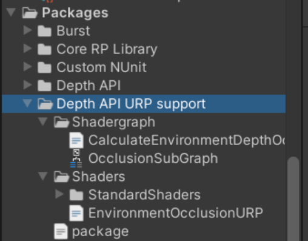

# Depth API
Depth API is a new feature that exposes to applications real-time, per-eye, per-frame, environment depth estimates from the headset’s point of view.
This repository shows how Depth API can be used to implement dynamic occlusions.
This technique is essential for rendering believable visual interactions between virtual and physical content in your apps, enabling a more coherent sense of reality for your users.

You can learn more about Depth API [here](https://developer.oculus.com/experimental/scene-depth-unity/).

## Health & Safety Guidelines
While building mixed reality experiences, we highly recommend evaluating your content to offer your users a comfortable and safe experience. Please refer to the [Mixed Reality H&S Guidelines](https://developer.oculus.com/resources/mr-health-safety-guideline/) before designing and developing your app using this sample project or any of our Presence Platform Features.

## Table of Contents
- [Dynamic Occlusion](#dynamic-occlusion)
- [Getting started with samples](#getting-started-with-samples)
- [Implementing Depth API](#implementing-depth-api)
  * [Getting started](#getting-started)
    + [1. Prerequisites](#1-prerequisites)
    + [2. Adding occlusions to a scene](#2-adding-occlusions-to-a-scene)
    + [3. Project Setup Tool](#3-project-setup-tool)
    + [4. Adding occlusion shaders to our objects](#4-adding-occlusion-shaders-to-our-objects)
      - [**For BiRP**](#for-birp)
      - [**For URP**](#for-urp)
    + [5. Enabling/configuring occlusions](#5-enablingconfiguring-occlusions)
      - [Occlusions on UI](#occlusions-on-ui)
    + [6. Using Environment depth bias to solve z-fighting in occlusion shaders](#6-using-environment-depth-bias-to-solve-z-fighting-in-occlusion-shaders)
    + [7. Using hands removal](#7-using-hands-removal)
    + [8. Implementing occlusion in custom shaders](#8-implementing-occlusion-in-custom-shaders)
    + [9. Using Shader Graph](#9-using-shader-graph)
      - [1. LitOccluded](#1-litoccluded)
      - [2. Stylized shaders](#2-stylized-shaders)
    + [10. Raycasting](#10-raycasting)
    + [11. Testing](#11-testing)
    + [12. Updating from pre v67 version of Depth API](#12-updating-from-pre-v67-version-of-depth-api)
      - [Upgrade guide](#upgrade-guide)
      - [Structure change](#structure-change)
      - [Components/Scripts changes](#componentsscripts-changes)
      - [Shader changes](#shader-changes)
    + [13. Troubleshooting](#13-troubleshooting)
  * [Licenses](#licenses)

# Dynamic Occlusion
This repository contains two occlusion implementations: hard occlusion and soft occlusion.

* Hard occlusion is cheaper to compute, but has a jagged edge and more visible temporal instability.
* Soft occlusion is visually more appealing, but requires more GPU.


## Depth API Requirements
* **2022.3.1 and higher** or **2023.2 and higher**
* **Meta XR Core SDK (v67.0.0 or above)** by using one of the following methods:
  * You may get it from the [Unity Asset Store](https://assetstore.unity.com/packages/tools/integration/meta-xr-core-sdk-269169).
  * Import the **com.meta.xr.sdk.core (v67.0.0 or above)** package from Unity's package manager. Follow the instructions on importing individual SDKs in Unity outlined [in the official Meta XR Packages documentation](https://developer.oculus.com/documentation/unity/unity-package-manager/).
* **Oculus XR Plugin** package version - **4.2.0**
* The Depth API packages, listed further down in this document under [Adding occlusion shader to our objects](#4-adding-occlusion-shaders-to-our-objects)
* Meta Quest 3

# Getting started with samples

### Using GitHub
First, ensure you have Git LFS installed by running this command:
```sh
git lfs install
```

Then, clone this repo using the **Code** button above, or this command:
```sh
git clone https://github.com/oculus-samples/Unity-DepthAPI
```

### Unity Projects
Get started by setting up Unity with our [Unity Set Up guide](https://developer.oculus.com/documentation/unity/book-unity-gsg/). See the Requirements section above for minimum versions of engine supported.

Open one of the two sample projects, DepthAPI-BiRP or DepthAPI-URP, located in the cloned Unity-DepthAPI folder.
Both implement the same examples, and exist to showcase different rendering pipelines that Unity offers: Built-in and URP respectively.
See [Unity's render pipeline overview article](https://docs.unity3d.com/Manual/render-pipelines-overview.html) to understand the differences.

### Scenes
The scenes are located in the same path for both sample projects: `./Assets/DepthAPISample/Scenes`.

#### OcclusionToggler
This scene showcases the general setup of the occlusion feature and how to switch between different modes.

When the scene is built for device, users can press the A button on the right controller to toggle between three modes: NoOcclusion, HardOcclusion and SoftOcclusion.


#### SceneAPIPlacement
This example covers the solution for z-fighting between virtual objects and environment depth when they are placed close to real surfaces. This Unity scene utilizes the Scene API to enable the precise placement of virtual posters on detected walls. This is a worst case scenario for z-fighting; this example shows how it can be mitigated.

Supplied shaders contain a float `_EnvironmentDepthBias` property that can be changed from the code. The SceneAPIPlacement scene shows how this can be set and modified programmatically.

Depth API measurements have an inherent error that scales with distance. The environment depth bias formula is implemented accordingly. This means that the value that is supplied to `_EnvironmentDepthBias` stands for virtual depth offset by 1 unit distance away from the camera. The offset is calculated towards the camera; a higher value means the virtual object will be brought closer to the camera. `_EnvironmentDepthBias` scales linearly with metric distance. We recommend using a value of around 0.06 but the value may depend on the type of content that is being placed.


#### HandsRemoval
This scene showcases the removal of hands from the depth map. In their stead we use hand tracking to render OVRHands and we use them as a mask.
> Note: HandsRemoval feature requires hands tracking to be enabled on your quest device.


# Implementing Depth API

## Getting started

### 1. Prerequisites

Make sure you have the supported Unity setup listed above.

Ensure Passthrough is working in your project by following [these instructions](https://developer.oculus.com/documentation/unity/unity-passthrough-gs/).

### 2. Adding occlusions to a scene

To add occlusions to your scene, add the `EnvironmentDepthManager.cs` component anywhere in your scene. This script is located in Meta XR Core SDK under `Scripts/EnvironmentDepth`.

Once you have done this, hit Ctrl-S to save your scene. You now need to add the **Passthrough Feature** to your scene (if you don’t already have it). You can use PST to handle this process automatically. This feature is described in the next section. Passthrough is essential for Depth API to function. More info on passthrough can be found in [the official documentation](https://developer.oculus.com/documentation/unity/unity-passthrough-gs/).

An app that wants to use Depth API needs to request spatial data permission during the app’s runtime. The application must prompt users to accept the `USE_SCENE` permission. Simply call this line of code wherever you wish to prompt the user with the permission request window:
```C#
Permission.RequestUserPermission("com.oculus.permission.USE_SCENE", permissionCallbacks);
```
Alternatively, you can check the **Scene** box under the **Permissions request on startup** section in **OVRManager**. This will ask the user to grant scene permission on app startup.


### 3. Project Setup Tool

Depth API has several requirements that need to be met before it can work:
* Graphics API needs to be set to Vulkan.
* Stereo Rendering Mode needs to be set to Multiview.
* The Passthrough feature needs to be enabled and integrated into every scene that will use Depth API.
* Android Manifest needs the `USE_SCENE` permission to be enabled by setting scene support to **Required** in OVRManager.

To aid with this, you can use the Project Setup Tool (PST). This will detect any problems and/or recommendations and provides an easy way to easily fix them. To access this tool you have two options:

* In the bottom right corner of the editor, there is a small Meta icon. Clicking on it will bring up a menu that lets you access the PST. It also has a notification badge whenever any issues are detected to let you know that a fix is required.


* You can also access PST from Unity’s top menu **Meta** > **Tools** > **Project Setup Tool**

Once open, you will be presented with a menu that displays all issues and recommendations for solutions. All outstanding issues need to be fixed before the Depth API can work. **Recommended Items** should be applied as well.


### 4. Adding occlusion shaders to our objects

Depth API supplies shader libraries and a shadergraph subgraph that can help you modify your own shaders and shadergraphs so that they support occlusions, as well as some basic shaders to get you started. For modifying your own shaders, see the [implementing occlusion in custom shaders section](#8-implementing-occlusion-in-custom-shaders) in this documentation. For any object to be occluded, they need to have materials with shaders that support occlusions applied on them.

For ease of use, this repository includes two support packages (one for URP and another for BiRP) that supply useful shaders.

To import these Depth API packages into Unity, follow these steps:

* For BiRP, the following package needs to be [imported from a git url](https://docs.unity3d.com/Manual/upm-ui-giturl.html):

```
https://github.com/oculus-samples/Unity-DepthAPI.git?path=/Packages/com.meta.xr.depthapi
```

* If your project uses URP, import this package for access to URP occlusion shaders. The URL for this package is:
```
https://github.com/oculus-samples/Unity-DepthAPI.git?path=/Packages/com.meta.xr.depthapi.urp
```

Depending on which of the [rendering pipelines](https://docs.unity3d.com/Manual/render-pipelines.html) you use in your project, follow the relevant section below.

#### **For BiRP**
Let’s consider the objects in your scene. If you wish to have them be occluded we need to apply the appropriate shader to their materials. If you have an object with a **Standard** shaded material on it, simply change the shader in the material to **OcclusionStandard**. You can find this shader under **Meta/Depth/BiRP**` when selecting the shader.


These are the shaders that come pre-packaged with Depth API for BiRP:

| Unity shader          | Depth API shader               |
|-----------------------|--------------------------------|
| Standard              | Occlusion Standard             |
| ParticleStandardUnlit | OcclusionParticleStandardUnlit |

#### **For URP**
Consider the objects in your scene. If we wish to have them be occluded we need to apply the appropriate shader to their materials. If you have an object that has Unity’s **Lit** shaded material in your scene simply change the shader to the Depth API variant shader called **Occlusion Lit**. You can find this shader under **Meta/Depth/URP/** when selecting the shader.


These are the shaders that come prepackaged with Depth API for URP:

| Unity Shader                          | Depth API shader                                |
|---------------------------------------|-------------------------------------------------|
| Lit                                   | Occlusion Lit                                   |
| Unlit                                 | Occlusion Unlit                                 |
| Simple Lit                            | Occlusion Simple Lit                            |
| Baked Lit                             | Occlusion Baked Lit                             |
| Particles / Unlit (/Lit / Simple Lit) | Occlusion Particles / Unlit (/Lit / Simple Lit) |

### 5. Enabling/configuring occlusions

The **EnvironmentDepthManager.cs** component that we added in the previous steps lets you set occlusion types in your project.


To change occlusion behaviour from code, you may refer to the code snippet below on how to use the API.

```C#
[SerializeField] private EnvironmentDepthManager _environmentDepthManager;
private void Example()
{
    //Check if this feature is supported on your platform
    if(!EnvironmentDepthManager.IsSupported)
    {
        Debug.Log("This feature is not supported");
        return;
    }
    //enables the feature and makes depth textures available
    _environmentDepthManager.enabled = true;

    //sets occlusion mode to "SoftOcclusion" -- this is the default value
    _environmentDepthManager.OcclusionShadersMode = OcclusionShadersMode.SoftOcclusion;

    //sets occlusion mode to "HardOcclusion"
    _environmentDepthManager.OcclusionShadersMode = OcclusionShadersMode.HardOcclusion;

    //sets occlusion mode to "None" -- it's a good idea to disable environmentDepthManager to save resources in this case
    _environmentDepthManager.OcclusionShadersMode = OcclusionShadersMode.None;

    //disables the feature. Frees up resources by not requesting depth textures from the system
    _environmentDepthManager.enabled = false;
}
```
#### Occlusions on UI


To add occlusions to UI, an OcclusionCutout shader is provided in each support package. Follow these steps to add occlusions to your UI:

1) Add a panel or image to your UI hierarchy at the very bottom (so that it is rendered last). Make sure it covers the entire UI.
2) Create a new material and assign it the OcclusionCutout shader.
   > For URP the shader is named 'OcclusionCutoutURP' while for BiRP it is named 'OcclusionCutoutBiRP'.

   
3) Assign the material created at 2) to the panel added at 1) . It's a good idea to remove `Raycast target` from said panel so it doesn't interfere with potential input on your UI.

4) (Optional) You may assign an image in the "Source Image" field to have it act like a mask. Anywhere there's is 0 in the source image's alpha channel, occlusions will not occur.

### 6. Using Environment depth bias to solve z-fighting in occlusion shaders

Provided BiRP and URP occlusion shaders have a property that controls environment depth bias. As provided shaders reuse Unity's material editors, the property can only be changed through scripts. The package provides a utility script 'OcclusionDepthBias.cs' that lets you easily change the EnvironmentDepthBias property on any game object by simply calling its public DepthBiasAdjust() function.


Alternativelly, you may set the value of "_EnvironmentDepthBias" from any material that has an occlusion shader on it.

```C#
material.SetFloat("_EnvironmentDepthBias", DepthBiasValue);
```
### 7. Using hands removal

The API supports removing hands from the depth map (in other words, your hands will not occlude virtual content from the wrists up). To use this functionality, simply set the `RemoveHands` property from the depth manager.

```C#
        private EnvironmentDepthManager _environmentDepthManager;

        private void Awake()
        {
            //remove hands from the depth map
            _environmentDepthManager.RemoveHands = true;

            //restore hands in the depth map
            _environmentDepthManager.RemoveHands = false;
        }
```
> Note: **HandsRemoval feature requires hands tracking to be enabled on your quest device. Your hands will be tracked the moment you put down the controllers.**

> Note: **The sample in this repository provides a useful example on how to utilize this feature. In there, we remove hands from the depth map and we replace them with hand tracking hands that we then use as a mask to clip any object under them, yielding high resolution hand occlusion.**

### 8. Implementing occlusion in custom shaders

If you have your own custom shaders you can convert them to occluded versions by applying some small changes to them.

For BiRP, use the following include statement:
```ShaderLab
#include "Packages/com.meta.xr.sdk.core/Shaders/EnvironmentDepth/BiRP/EnvironmentOcclusionBiRP.cginc"
```
For URP:
```ShaderLab
#include "Packages/com.meta.xr.sdk.core/Shaders/EnvironmentDepth/URP/EnvironmentOcclusionURP.hlsl"
```
#### Step 1. Add occlusion keywords
```Shaderlab
// DepthAPI Environment Occlusion
#pragma multi_compile _ HARD_OCCLUSION SOFT_OCCLUSION
```
#### Step 2. If the struct already contains world coordinates - skip this step, otherwise, use the special macro, META_DEPTH_VERTEX_OUTPUT, to declare the field:
```ShaderLab
struct v2f
{
   float4 vertex : SV_POSITION;


   float4 someOtherVarying : TEXCOORD0;


   META_DEPTH_VERTEX_OUTPUT(1) // the number should stand for the previous TEXCOORD# + 1


   UNITY_VERTEX_INPUT_INSTANCE_ID
   UNITY_VERTEX_OUTPUT_STEREO // required to support stereo
};
```
#### Step 3. If the struct already contains world coordinates - skip this step. If not, use the special macro, META_DEPTH_INITIALIZE_VERTEX_OUTPUT, like so:
```Shaderlab
v2f vert (appdata v) {
   v2f o;

   UNITY_SETUP_INSTANCE_ID(v);
   UNITY_INITIALIZE_VERTEX_OUTPUT_STEREO(o); // required to support stereo

   // v.vertex (object space coordinate) might have a different name in your vert shader
   META_DEPTH_INITIALIZE_VERTEX_OUTPUT(o, v.vertex);

   return o;
}
```
#### Step 4. Calculate occlusions in fragment shader, with the use of the META_DEPTH_OCCLUDE_OUTPUT_PREMULTIPLY macro:
```Shaderlab
half4 frag(v2f i) {
   UNITY_SETUP_STEREO_EYE_INDEX_POST_VERTEX(i); required to support stereo

   // this is something your shader will return without occlusions
   half4 fragmentShaderResult = someColor;

   // Third field is for environment depth bias. 0.0 means the occlusion will be calculated with depths as they are.
   META_DEPTH_OCCLUDE_OUTPUT_PREMULTIPLY(i, fragmentShaderResult, 0.0);

   return fragmentShaderResult;
}
```
If you already have a world position varyings being passed to your fragment shader, you can use this macro:
```Shaderlab
META_DEPTH_OCCLUDE_OUTPUT_PREMULTIPLY_WORLDPOS(yourWorldPosition, fragmentShaderResult, 0.0);
```

> Note: **If you only get occlusions working in one eye, make sure that you added the UNITY_SETUP_STEREO_EYE_INDEX_POST_VERTEX(i) macro in your fragment shader and the subsequent macros related to stereo rendering as outlined in the above code snippets that have the `// required to support stereo` comment**

### 9. Using Shader Graph

Depth API supports adding occlusions via Shader Graph. A subgraph is provided in the API, called 'OcclusionSubGraph', that exposes occlusion value. This subgraph will output the value 0 if the object is occluded and 1 otherwise.


To aid in its usage, Meta XR Core SDK and the URP sample project provide some example use cases:

#### 1. LitOccluded
This is a simple Shader Graph that uses the aforementioned subgraph to implement occlusions. It works by multiplying the final color's alpha value with the occlusion value. The result will be either the original alpha color if not occluded or it will be 0 if the object is occluded. To occlude the object, we feed in this value in the final alpha value of the fragment shader, enable alpha culling and set the threshold to 0.01 (or a very small value that is greater than 0). This shadergraph is located in Meta XR Core SDK, under `Shaders/EnvironmentDepth/URP/Shadergraph`.


#### 2. Stylized shaders
Once an object is occluded we can alternatively apply various effects to it rather than clip it from view. For instance, the stylized occlusion Shader Graph example makes occluded items "wavy" when occluded.


### 10. Raycasting

Starting with v71, we've released our official solution for depth raycasting and is part of [MRUK](https://developers.meta.com/horizon/documentation/unity/unity-mr-utility-kit-overview). You can find more information on it [here](https://developers.meta.com/horizon/documentation/unity/unity-mr-utility-kit-features#environment-raycasting-beta). There's also a sample within MRUK that showcases its usage [here](https://developers.meta.com/horizon/documentation/unity/unity-mr-utility-kit-features#environment-raycasting-beta).


### 11. Testing
Build the app and install it on a Quest 3. Notice the objects with occluded shaders will have occlusions.


### 12. Updating from pre v67 version of Depth API

As a major update in v67, the majority of Depth API functionality has been added to the Meta XR Core SDK. The code base has also been significantly refactored. The v67 version of the Quest OS has also changed the way it supplies depth textures. The refactor to the Unity Depth API code reflects these changes. As a result, occlusions now look more accurate, and their performance has improved. This section will outline the differences in code structure, and a guide on updating existing projects to v67 version of core.

#### Upgrade guide
* Update com.meta.xr.sdk.core to v67.0.0
* Update com.meta.xr.depthapi to v67.0.0
* Update com.meta.xr.depthapi.urp to v67.0.0 (if applicable)
* `EnvironmentDepthTextureProvider.cs` and `EnvironmentDepthOcclusionController.cs` have merged into `EnvironmentDepthManager.cs`
* For custom shaders, the library paths have changed:

Old API:
   ```Shaderlab
   #include "Packages/com.meta.xr.depthapi/Runtime/BiRP/EnvironmentOcclusionBiRP.cginc"

   #include "Packages/com.meta.xr.depthapi/Runtime/URP/EnvironmentOcclusionURP.cginc"
   ```
New API:
   ```Shaderlab
   #include
   'Packages/com.meta.xr.sdk.core/Shaders/EnvironmentDepth/BiRP/EnvironmentOcclusionBiRP.cginc'

   #include "Packages/com.meta.xr.sdk.core/Shaders/EnvironmentDepth/URP/EnvironmentOcclusionURP.hlsl"
   ```

* Check PST for any problems to solve (if any)

#### Structure change
Before, to get occlusions into your project, you had to import the public depth API packages mentioned above. These packages contained all of the code and shaders required.

Core/BiRP package


URP package



Starting with v67.0.0, the base core functionality of Depth API has moved to the Meta XR Core SDK, away from these GitHub packages. However, support shaders have been left in those packages, so the flow of updating shaders in your materials will remain unchanged.


#### Components/Scripts changes

The most important change to the components is that there are no longer two scripts. Their functionality haves merged into one. So `EnvironmentDepthTextureProvider.cs` and `EnvironmentDepthOcclusionController.cs` turn into `EnvironmentDepthManager.cs`.

Simply replace the components with the new one in your scene to update.


Old API:

```C#
private EnvironmentDepthTextureProvider _depthTextureProvider;
private EnvironmentDepthOcclusionController _occlusionController;

private void Awake()
{
   //enable depth
   _depthTextureProvider.SetEnvironmentDepthEnabled(true);
   //disable depth
   _depthTextureProvider.SetEnvironmentDepthEnabled(false);

   // set occlusions to the desired mode : none, soft, hard
   // Note: this also enables/disables environment depth automatically as
   // needed, so this is the only call you really need to make.
   _occlusionController.EnableOcclusionType(OcclusionType.SoftOcclusion, true)
   // remove hands from depth map
   _depthTextureProvider.RemoveHands(true);

   // restore hands in depth map
   _depthTextureProvider.RemoveHands(false);
}
```
New API:

```C#

public IEnumerator Example()
{
    // check the support
    // static so users can check the support before creating EnvironmentDepthManager
    if (!EnvironmentDepthManager.IsSupported)
        yield break;

    var depthManager = gameObject.AddComponent<EnvironmentDepthManager>();

    // enable evn depth with soft occlusions
    depthManager.enabled = true;
    depthManager.OcclusionShadersMode = OcclusionShadersMode.SoftOcclusion;

    // remove hands from the depth texture
    depthManager.RemoveHands = true;

    // wait until the depth texture becomes available
    while (!depthManager.IsDepthAvailable)
        yield return null;

    // disable env depth
    depthManager.enabled = false;

    // enable env depth without occlusion
    depthManager.enabled = true;
    depthManager.OcclusionShadersMode = OcclusionShadersMode.None;
}
```
#### Shader changes

When it comes to making your own custom shader, other than the path to our EnvironmentOcclusion shaders, nothing major has changed.

Old API:
```Shaderlab
#include "Packages/com.meta.xr.depthapi/Runtime/BiRP/EnvironmentOcclusionBiRP.cginc"

#include "Packages/com.meta.xr.depthapi/Runtime/URP/EnvironmentOcclusionURP.cginc"
```
New API:
```Shaderlab
#include
'Packages/com.meta.xr.sdk.core/Shaders/EnvironmentDepth/BiRP/EnvironmentOcclusionBiRP.cginc'

#include
"Packages/com.meta.xr.sdk.core/Shaders/EnvironmentDepth/URP/EnvironmentOcclusionURP.hlsl"
```

### 13. Troubleshooting

* There is a known issue with the package manager in some recent Unity versions (i.e. 2022.3.16). If anyone is experiencing unexpected behavior with their Unity projects that use Meta XR Core SDK, check the package manager and look for errors under these packages. It should look like this:


   Some recent Unity versions have known problems with Meta packages.

   Solution: just close the editor, sign out of Unity and then sign back in.

* Updating the com.unity.xr.oculus package from version 4.2.0-experimental to 4.2.0 will often yield in an editor crash. The solution here is to rebuild the Library folder. This only needs to be done once.
* Known issue: In Link, resetting the view can offset occlusions.
* Known issue: XRSim versions that are older than v69 do not work with Environment Depth.

## Licenses
The Meta License applies to the SDK and supporting material. The MIT License applies to only certain, clearly marked documents. If an individual file does not indicate which license it is subject to, then the Meta License applies.
